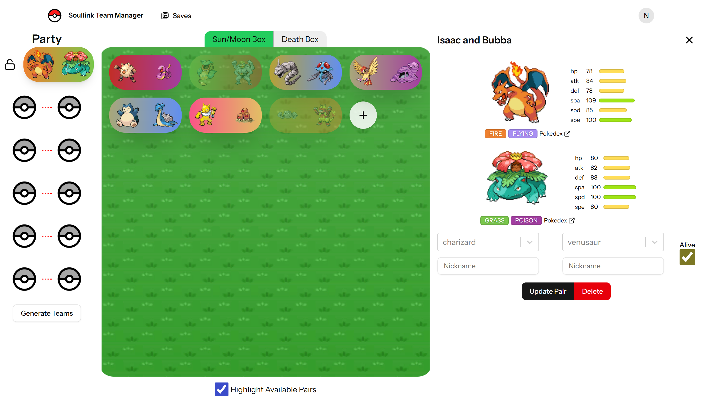
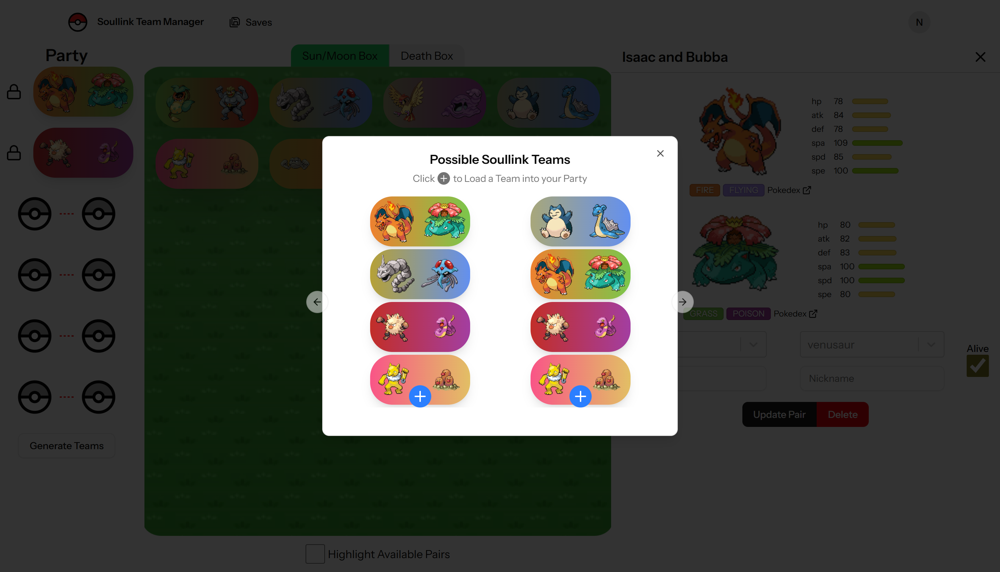

<div align="center">

&nbsp;&nbsp;&nbsp;&nbsp;

### Make team-building quick and easy for your two-player Pokémon Nuzlocke

A tracker and team-builder for the **Soullink Nuzlocke** challenge — two players, paired Pokémon, shared fate.

[**Live site → soullink.christosefstathiades.com**](https://soullink.christosefstathiades.com)


[](LICENSE)

</div>

---

## What is a Soullink?

A [Soullink](https://nuzlockeuniversity.ca/nuzlocke-variants/soul-link-nuzlocke-rules/) is a two-player co-op variant of the Pokémon Nuzlocke challenge. Each player catches the first Pokémon on every route, and the two catches become a **linked pair** — if one faints, its partner is considered dead too. There's a catch that makes team-building tricky: **two linked Pokémon in your party can't share a type**, so picking a combined team of six is a constant balancing act.

Soullink takes care of the bookkeeping for you. Track every pair you catch, see who's alive and who's in the death box, and let the app work out which teams are even legal to run.

## Features

- **🔗 Pair tracking** — Log each player's catch as a single pair. Pokémon species, nicknames, types, and base stats are pulled automatically from [PokéAPI](https://pokeapi.co/).
- **📦 Living box & death box** — Your PC box holds living pairs; lost pairs move to a separate death box with a single checkbox toggle.
- **🧮 Smart team-builder** — Build a party of six and turn on **Highlight available pairs** to instantly fade out anything you can't legally add because of a shared typing.
- **🔒 Lock & generate** — Lock the pairs you've already committed to, then let the app **generate full legal team suggestions** around them and import a team in one click.
- **⚙️ Type normalization** — Per-save toggles for older-gen quirks: swap the Normal/Flying order, or revert retconned Fairy typings (Clefairy, Snubbull and Togepi lines) back to their original types.
- **🎨 Custom PC box wallpaper** — Pick a background for your box, just like in the real games.
- **💾 Local-first saves with JSON export/import** — No accounts, no server. Your saves live in your browser's `localStorage`, and you can export everything as a JSON file to back it up or move it to another device/share it with your soullink partner.

## Screenshots

<div align="center">

| Track encounters & build your team | Generate legal teams |
| :---: | :---: |
|  |  |

</div>

> The live site includes a full step-by-step walkthrough on the landing page.

## How it works

Soullink is a **client-only React SPA** — there's no backend and no database.

- **Data layer** — All saves and pairs are kept in `localStorage` under a single key, managed by a small store (`src/lib/storage.ts`) that React components subscribe to via `useSyncExternalStore`. The "no shared primary type" rule and unique-catch-location rule are enforced in the store's `createPair`/`updatePair` mutators.
- **Pokémon data** — `src/lib/pokemon.ts` is the only thing that talks to PokéAPI, and all type lookups run through one place so the per-save normalization toggles apply consistently.
- **Team state** — The six-slot party you're assembling and your locked pairs also live in `localStorage`, keyed per save.
- **Export/import** — The dashboard can download every save (with its pairs) as a JSON file and import such files back, appending them as new saves.

## Getting started

```bash
npm install
npm run dev      # Vite dev server at http://localhost:5173
npm run build    # production build into dist/
```

Other scripts: `npm run lint` (ESLint), `npm run types` (TypeScript), `npm run format` (Prettier), `npm run preview` (serve the production build).

> **Note:** the Pokémon sprites and other image assets served from `public/storage/` are not part of this repository (they are not MIT-licensed — see below) and must be supplied separately.

## Built with

| Layer | Tech |
| --- | --- |
| Frontend | React 19 · TypeScript · react-router · Tailwind CSS v4 |
| Tooling | Vite 7 · ESLint · Prettier |
| Data | [PokéAPI](https://pokeapi.co/) · browser `localStorage` |
| UI | shadcn/Radix primitives · Embla carousel · lucide-react |

## License

The source code in this repository is released under the [MIT License](LICENSE). This covers the **application code only** — Pokémon sprites, names, and other Pokémon assets are not included and remain the property of their respective owners.

## Credits

Design & original content © Christos Efstathiades, 2025–2026.

Pokémon images & names © 1995–2026 Nintendo / Creatures Inc. / GAME FREAK inc. Soullink is a fan project and is not affiliated with or endorsed by Nintendo, The Pokémon Company, or PokéAPI.
